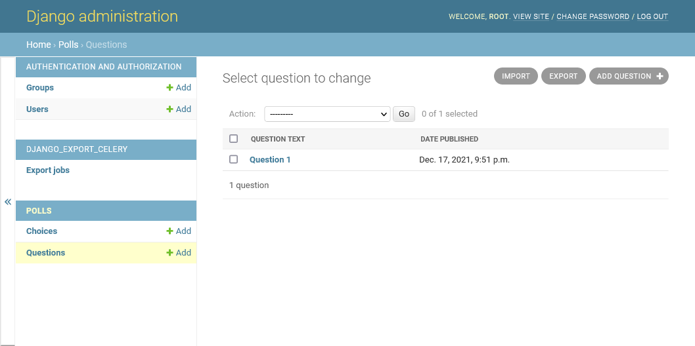
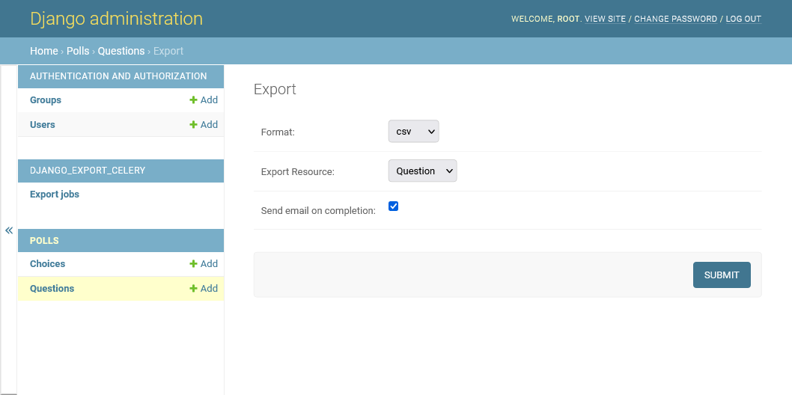
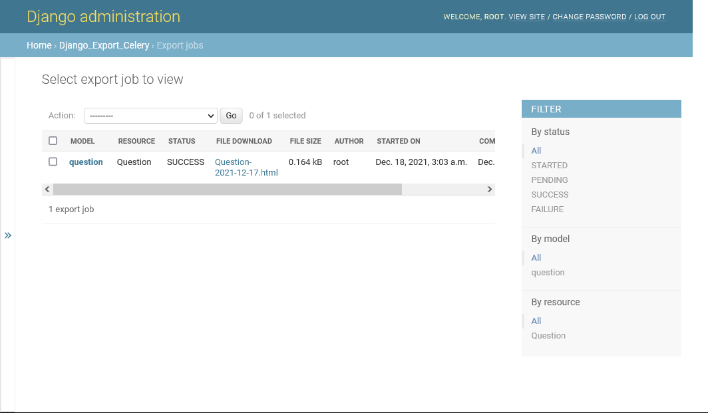

Overview
===

django-export-celery is a Django application that enables long processing exports using `celery` and `django-import-export`


Dependencies
===
Python 3.6+

Packages
```text
Django>=3.1
celery>=5.0.0
django-import-export>=2.2.0
django-author>=1.0.2
```

Installation and Configuration
===
Celery must be setup before starting. \
Please refer to [Using Celery with Django](https://docs.celeryproject.org/en/v5.2.0/django/first-steps-with-django.html) for more information.

1. Install with `pip`
```
pip install django-export-celery
```

2. Add apps to `INSTALLED_APPS` and `MIDDLEWARE` to project settings.
```python
# settings.py
INSTALLED_APPS = (
    ...
    'import_export',
    'author',
    'django_export_celery',
)

MIDDLEWARE = (
    ...
    'author.middlewares.AuthorDefaultBackendMiddleware',
)

# Optionally you can overwrite the default file upload location
DJANGO_EXPORT_CELERY_UPLOAD_TO = 'export_job_file_upload_location'
```

3. Setup `model` and `resources`
```python
# apps/models.py
from django.db import models
from import_export.resources import ModelResource


class Question(models.Model):
    question_text = models.CharField(max_length=200)
    pub_date = models.DateTimeField('date published')

    @staticmethod
    def get_export_resources():
        return {
            'rsc1': ('Question', QuestionResource),
        }


class Choice(models.Model):
    question = models.ForeignKey(Question, on_delete=models.CASCADE)
    choice_text = models.CharField(max_length=200)
    votes = models.IntegerField(default=0)


class QuestionResource(ModelResource):
    class Meta:
        model = Question

```

4. Add `ExportCeleryMixin` to admin view in `admin.py`
```python
# apps/admin.py
from django.contrib import admin
from .models import Question, Choice
from import_export.admin import ImportExportMixin
from django_export_celery.mixins import ExportCeleryMixin


@admin.register(Question)
class QuestionAdmin(ExportCeleryMixin, admin.ModelAdmin):
    list_display = (
        'question_text',
        'pub_date',
    )

# also supports django-import-export admin mixins like so
@admin.register(Choice)
class ChoiceAdmin(ImportExportMixin, ExportCeleryMixin, admin.ModelAdmin):
    list_display = (
        'question',
        'choice_text',
        'votes',
    )

```


How to use
===
1. Click `EXPORT` button in upper right in model view


2. Select export `Format` and click `SUBMIT`


3. Export jobs and their statuses can be found in `Export Jobs`



Demo App
===
`./project/` contains the necessary files to start a sample project

To get started
```
cd project
pip install -r requirements.txt
python manage.py migrate
python manage.py createsuperuser
python manage.py runserver 8000
```

TODO: dummy data setup

TODO: Docker setup

Known Issues
===
A list of known issues to be patched in the future

* Does not respect ordering when exporting
* File format `ods` is not supported


Issue Tracker
===
If you have any bugs, suggestions, or compliants please report an issue [here](https://github.com/mrtoffou/django-export-celery/issues)


References
===
* https://www.djangoproject.com/
* https://github.com/django-import-export/django-import-export
* https://docs.celeryproject.org/en/stable/getting-started/introduction.html
* https://github.com/lambdalisue/django-author
